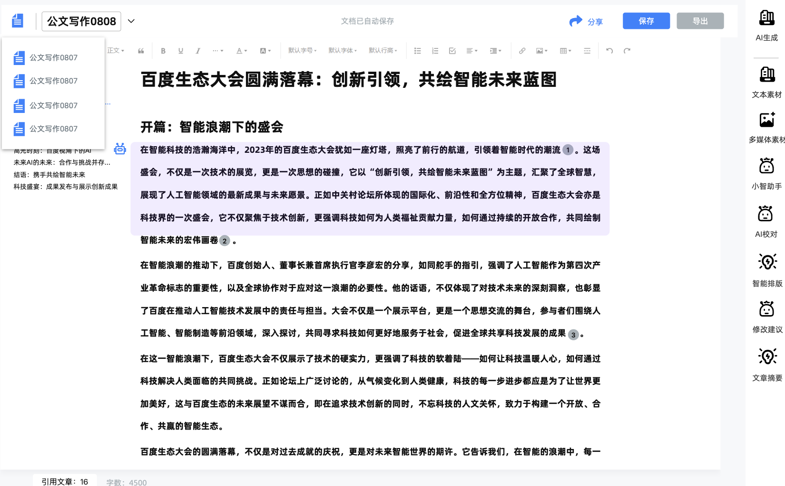

# PRD｜氢能可研报告生成助手 V2.0

# 一：基础信息

## 版本信息

产品版本：v2.0
创建时间：6月12
创建人：XX

## 变更日志

| 时间 | 文档版本 | 变更人 | 主要变更内容 |
| --- | --- | --- | --- |
| 2025.6.12 | v1.0 | XX | 新建文档，并对文档进行完善 |
| 2025.6.17 | v1.1 | XX | 修改知识库结构设计 |
| 2025.6.24 | v2.0 | XX | 补充产品约束、核心实体与状态定义、功能清单与详细交互对齐、埋点与非功能需求 |
| 2026.8.12 | v2.1 | XX | 明确九章固定规则、全局优化为可选操作，并统一失败状态与章节确认埋点 |

## 名词解释

| 术语 / 缩略词 | 说明 |
| --- | --- |
| RAG | 检索增强生成（Retrieval-Augmented Generation）。先从知识库检索相关内容，再把检索结果连同用户问题一起交给大模型生成答案。 |
| 向量化（Embedding） | 把一段文字转换成一串数字（向量），让计算机能够计算两段文字的语义相似度。RAG 的"检索"就靠它。 |
| 分块（Chunking） | 把长文档切成若干小段，每段单独向量化。切太粗检索不精准，切太细语义不完整。 |
| 重排（Re-rank） | 初步检索回来的片段，再用更精准的模型筛一遍，把最相关的排到前面。 |
| 流式输出（Streaming） | 模型一个字一个字地往外吐，而不是等全部生成完一次性返回。用户看到的是"打字机"效果。 |

---

# 二：项目背景

## 需求背景

| 需求方 | 场景 | 痛点 | 诉求 |
| --- | --- | --- | --- |
| 国华（研究员） | 一名专业的可行性研究人员，在工作时间内，需要独立撰写一份中等复杂度的氢能项目可行性研究报告。 | 完成一份报告需要 5-6 个工作日，时间成本极高 | 提升可行性研究报告的撰写效率，缩短报告产出周期。 |
| | 在海量的内部项目文档、外部数据库、行业期刊中搜寻、筛选、验证数据。 | 大量时间被繁琐、重复、低附加值的劳动占据。 | 需要快速、精准地从海量、多源的文档和数据中检索、筛选和验证信息 |
| 国华（管理员） | 经验丰富的高级研究员离职，过往项目中积累的判断、经验和未归档的数据很难被完整地传递给新同事。 | 核心员工离职导致宝贵的专家经验无法沉淀和复用，公司知识资产流失。 | 需要一个确保数据和术语在跨部门间保持一致的机制 |

## 🌟项目目标

- **北极星指标：AI 生成报告采纳率 > 70%**

最直接地衡量了我们为用户创造的核心价值：AI 生成的内容对用户是有用的。

**指标落地说明**：
- **"采纳"的定义**：用户对某一章节完成"确认"操作（点击确认按钮，或未做任何修改即进入下一步），则该章节视为"被采纳"。全文采纳率 = 被采纳章节数 ÷ 总章节数。
- **埋点支撑**：需在用户确认动作处埋点上报，指标由埋点自动产出，不依赖用户主动反馈。
- **为什么不用"用户未修改字数占比"**：有些修改是润色性质的，不应算作"不采纳"。用确认动作更客观。

**成本约束**：以九章报告为例，单次完整生成包含九次章节调用、一次全局优化和若干次检索。需关注单份报告的生成成本，作为模型选型的依据之一。

## **用户画像**

| 维度 | 说明 |
| --- | --- |
| 角色 | 氢能/新能源行业研究员、咨询顾问 |
| 专业背景 | 能源、化工、电力或相关工科，熟悉可研报告撰写规范 |
| 工作场景 | 办公室桌面端，需要同时查阅多份 PDF/Word 文档并撰写报告 |
| 核心任务 | 从需求分析开始，完成从大纲到定稿的全流程报告撰写 |
| 技术水平 | 熟练使用 Word/PDF 阅读器，有基础 AI 工具使用经验（如 ChatGPT），但无编程能力 |
| 核心痛点 | 查资料和打字占据 80% 时间，真正的分析和判断只占 20% |
| 期望 | AI 帮我把查资料和写初稿的活干了，我负责判断和修改 |

## 原始用户流程图

下图为产品上线前，研究员撰写一份可研报告的真实流程：

```text
研究员收到任务
    │
    ▼
打开可研报告模板，确认章节结构（30 分钟）
    │
    ▼
查阅内部项目资料，提取关键数据（2-3 小时）
    │
    ▼
查阅外部行业报告、政策文件，补充市场数据（2-3 小时）
    │
    ▼
逐章撰写初稿（2-3 天）
    │
    ▼
自查格式、术语统一性（1 小时）
    │
    ▼
提交审核，根据反馈修改（1-2 天）
    │
    ▼
定稿
```

对照产品流程（创建 → 生成大纲 → 逐章生成 → 全局优化 → 导出），产品替代的是中间 80% 的体力环节。

## 竞品分析

| 竞品名称 | 对标功能点 | 借鉴要点总结 | 截图或视频 |
| --- | --- | --- | --- |
| 笔灵 | 模版选择 | **优点分析**：采用了**高度场景化**的命名，如"心得体会"、"自定义撰写"等，用户能根据自己的写作意图，快速找到对应的功能。**借鉴思考**：我们虽然专注于可研报告，但内部也可以进行场景细分。可以分为"光伏发电可研报告"、"储能电站可研报告"、"氢燃料电池项目可研报告"等 |  |
| 新华妙笔 | 报告撰写入口 | **优点分析**：中间的对话框是界面的视觉中心，直接输入任何写作需求。符合已经习惯了对话式 AI 的用户的思维模式。**借鉴思考**：核心工作流是生成和编辑报告内容。用户除了可以通过按钮执行"润色"、"扩写"等结构化指令外，还可以随时在对话框里提出更开放、更复杂的需求 |  |
| 知网智能报告撰写 | 知识库驱动的智能写作 | 见附件调研报告 | [知识类应用细分调研--智能写作知网AI产品调研.pdf](图片和附件/知识类应用细分调研--智能写作知网AI产品调研.pdf) |

---

# 三：产品约束

> 以下五项是本产品的既定约束，界定了系统的行为边界，实现方案在此范围内展开。

## 约束一：章节间的上下文范围

逐章生成时，传入每章的上下文为：项目基础信息（项目名称、客户、技术路线、规模）+ 大纲全文 + 已生成各章的标题列表。**不传入前面章节的正文。**

- 章节标题已足以界定本章边界，例如第四章「建设方案与技术方案」不讨论投资估算（属第六章）
- 全文层面的行文连贯性由全局优化环节统一收尾

## 约束二：单章失败的处理方式

**每章独立存储，生成失败只标记该章，其余章节不受影响，用户可对单章重试。**

- 每章为独立记录，状态分：待生成 / 生成中 / 已完成 / 失败
- 失败章节在界面上显示"生成失败，点击重试"入口
- 用户对已完成但不满意的章节，同样可主动重试，与失败重试共用一套机制

## 约束三：生成过程的进度呈现

**大纲阶段采用流式输出（逐字呈现），逐章生成阶段采用章节级进度，不做逐字流式。**

- 大纲生成耗时 20-30 秒，流式呈现，用户可看到大纲逐步成形
- 逐章生成显示"正在生成：第四章 建设方案（4/9）"，每章完成后整段填入正文区
- 全部章节生成完毕后，正文区刷新为完整报告

> 本约束同时界定第五部分「分章节内容生成」的交互：以章节级进度展示为准。

## 约束四：溯源标注的生成方式

**来源信息由系统记录并回填，不由模型自行标注。**

- 检索时系统已记录每个片段的来源文档与页码
- 片段编号后传给模型，模型引用时只写编号（如 `[1]`、`[2]`）
- 渲染时将编号替换为真实来源（如 `[XX项目技术规范书.pdf, 第15页]`）
- 准确性要求：**标注的来源必须真实存在，不允许出现不存在的文档或页码**

## 约束五：内容生成的粒度

**按一级章节生成，共九次模型调用。子标题作为该章的写作要点随提示词传入。**

- 大纲确认后，九章排入生成队列
- V2.0 固定保留九个一级章节；用户可修改章节标题和子标题，但不可增删一级章节
- 每章调用一次模型，提示词包含该章的全部子标题作为写作框架
- 全文一致性与章间过渡由全局优化环节处理

---

# 四：功能规划

## 系统构成

本产品由四个部分组成，各部分职责如下：

| 组成部分 | 职责 |
| --- | --- |
| 报告工作台 | 用户看到和操作的界面：报告首页、创建向导、大纲确认、编辑预览、导出 |
| 流程控制 | 按固定顺序驱动整条主链路，记录每一步的状态，负责失败重试（见约束二） |
| 生成能力 | 三个环节各自调用一次模型：大纲生成、单章内容生成、全局优化，提示词见第五部分 |
| 知识库 | 参考文档的上传、解析与检索，为章节生成提供依据，并支撑内容溯源（第五阶段交付） |

主链路是线性的，顺序固定，不由模型决定下一步：

```
创建任务 → 提取项目信息 → 生成大纲 → 用户确认 → 逐章生成 → 预览 / 导出
                                                            └→ 全局优化（可选）
```

## 核心实体

系统需要长期保存的对象有三类。这是理解数据流的基础：

| 实体 | 说明 | 关键属性 |
| --- | --- | --- |
| 报告 | 一次可研报告任务，对应首页上的一张卡片 | 报告名称、创建时间、创建人、用户的原始需求描述、从需求中提取的项目信息（项目名称、地点、规模、投资方等）、当前状态 |
| 章节 | 报告下的一章，共九章，是生成和重试的最小单位 | 所属报告、章序号、章标题、子标题列表、正文内容、生成状态、失败原因 |
| 参考文档 | 用户上传的知识库文档 | 文件名、格式、上传时间、上传人、解析状态、页数 |

一份报告包含九个章节；一份报告可关联多份参考文档。

## 状态定义

**报告状态**：待生成大纲 → 大纲待确认 → 内容生成中 → 内容已生成 → 已优化。首页卡片显示的就是这个状态。

**章节状态**：未开始 → 生成中 → 已完成 / 失败。失败的章节保留失败原因，并提供单章重试入口（见约束二）。

报告整体不设"失败"状态：只要有章节失败，报告仍停留在内容生成阶段，用户可对失败章节逐个重试。

首页遇到单章失败时显示为“内容生成中（1章失败）”，不显示独立的“生成失败”报告状态。

## 功能清单

本产品共十二项功能，优先级按 P0/P1/P2 划分。P0 为主链路，缺任一项产品不成立。

| 一级功能 | 二级功能 | 描述 | 优先级 |
| --- | --- | --- | --- |
| 数据与知识库 | 手动文档上传与处理 | 支持用户批量上传 PDF、Word 文档。后端自动完成解析、清洗、分块和向量化。 | P0 |
| 报告创建 | 基于自然语言的报告任务创建 | 提供输入界面，允许用户通过一段自然语言描述报告主题、客户和核心要求。 | P0 |
| | 关联参考文档 | 创建任务时，允许用户勾选本次报告核心参考文档。 | P1 |
| 报告管理 | 报告首页（仪表盘） | 卡片式展示所有已创建的报告，含名称、时间、状态。用户登录后的默认页面。 | P0 |
| 核心 AI | 一键生成报告大纲 | 根据用户输入生成符合逻辑的报告大纲。 | P0 |
| | 分章节内容生成（RAG 流程） | 用户确认大纲后，逐章执行 RAG 检索 + LLM 生成，产出章节初稿。 | P0 |
| | 全局优化 | 对全文进行术语统一、风格润色、格式检查。 | P1 |
| 内容编辑与输出 | 文本内容查看与复制 | 基础只读/编辑界面，支持按章节复制、一键复制全文。 | P2 |
| | 内容溯源标注 | 生成内容中对引用自知识库的片段做来源标记，可点击查看原文。 | P1 |
| | 导出报告 | 导出为 .docx 格式，触发浏览器下载。 | P2 |
| AI 对话助手 | 对话式查询与指令 | 右侧面板：知识查询、划词润色/扩写/缩写。 | P2 |
| 用户与权限管理 | 角色权限控制 | 三级角色（研究员/管理员/超级管理员），动态展示/隐藏功能入口。 | P2 |

> **功能依赖**：「分章节内容生成」在启用参考文档后依赖知识库检索（RAG）。产品约定：RAG 与内容溯源标注排在第五阶段，此前章节内容由模型凭自身知识生成，因此前四阶段不存在该依赖。
>

## 交付阶段划分

十二项功能不一次性交付，按下表分六个阶段推进。每个阶段结束产出一份可验证的阶段性产物。

| 阶段 | 交付范围 | 阶段产物 | 验收标准 |
| --- | --- | --- | --- |
| 一 | 报告任务创建、项目信息提取、大纲生成 | 一份九章大纲 | 输入一段项目描述，产出的大纲九章齐全、每章带子标题 |
| 二 | 逐章内容生成、报告与章节状态、单章重试 | 九个章节内容 | 九章逐章生成完毕；任意一章失败时其余章节不受影响，且该章可单独重试成功 |
| 三 | 全文汇总、导出 .docx | 一份 Word 报告 | 导出的文件能用 Word 双击打开，九章顺序正确、标题层级正确 |
| 四 | 报告首页、创建向导、大纲确认、编辑预览、导出入口、等待与失败反馈 | 可操作的网页 | 全流程在页面上点击完成，不再依赖命令行；生成中有进度反馈，失败有重试按钮 |
| 五 | 文档上传解析、知识库检索、关联参考文档、内容溯源标注 | 带来源标注的报告 | 上传参考文档后生成的内容出现来源标记，点击可看到原文出处 |
| 六 | 全局优化、AI 对话助手、文本查看与复制、角色权限控制 | 完整产品 | 十二项功能全部可用，三级角色各自只看到自己权限内的功能入口 |

前三个阶段不涉及界面，产物是文件；第四阶段将前三阶段的能力封装为可操作的网页界面。第五阶段引入知识库检索与溯源，第六阶段补全全局优化、对话助手、权限控制等剩余能力。

---

# 五：功能需求

## 功能一：可研报告生成智能体

### 业务流程图

```text
                      ┌──────────────┐
                      │  用户登录     │
                      └──────┬───────┘
                             │
                      ┌──────▼───────┐
                      │  报告首页     │
                      │  (卡片列表)   │
                      └──┬───────┬───┘
                         │       │ 点击已有报告
                         │ 新建  │
                  ┌──────▼──┐ ┌─▼──────────┐
                  │ 创建报告  │ │ 进入已有报告 │
                  │ 描述需求  │ │ (含大纲确认  │
                  │ 关联文档  │ │  到导出)    │
                  └──────┬──┘ └─────────────┘
                         │
                  ┌──────▼──────────┐
                  │ 生成大纲         │
                  │ (流式输出)       │
                  └──────┬──────────┘
                         │
                  ┌──────▼──────────┐
                  │ 用户确认大纲     │◄── 用户可编辑大纲
                  │ (确认/修改/重试) │
                  └──────┬──────────┘
                         │ 确认
                  ┌──────▼──────────┐
                  │ 逐章生成         │
                  │ 第1章 → 第2章   │
                  │ → ... → 第9章  │
                  │ (单章失败可重试) │
                  └──────┬──────────┘
                         │
                  ┌──────▼──────────┐
                  │ 预览 / 导出      │
                  └──────┬──────────┘
                         │ 可选
                  ┌──────▼──────────┐
                  │ 全局优化后再导出 │
                  └─────────────────┘
```

### 交互逻辑图

交互逻辑以原型图为准，链接见第六部分「界面设计」。

### 详细交互设计

> 下表逐项说明各模块的入口、交互与反馈，原型图引用见表中链接。

| **模块** | **功能名称** | **原型图** | **详细交互说明** |
| --- | --- | --- | --- |
| **知识库管理** | **1.1 手动文档上传与处理** |  | **入口**：在主界面或专门的"知识库"页面，设有"上传文档"按钮。<br>**交互**：用户点击按钮后，可打开文件选择器，支持**批量选择**多个 PDF、Word 文档，或直接将文件**拖拽**到指定区域。<br>**反馈**：上传过程中，显示每个文件的上传进度条。上传完成后，系统在后台自动进行文档解析、数据清洗、文本分块和向量化，前端界面显示"处理中..."状态。处理成功后，文档出现在知识库列表中，并标记为"可用"。若处理失败，则给出明确的失败提示。<br>**实现注意**：解析和向量化是耗时的异步任务，前端需要轮询或订阅处理状态，不能同步等待上传接口返回。 |
| **报告生成** | 报告首页 |  | **入口**：用户登录后进入的第一个页面。<br>**交互**：以卡片形式平铺展示用户所有创建过的可研报告项目。每张卡片显示**报告名称、创建时间、当前状态**（如：大纲待确认、内容生成中、内容生成中（1章失败）、已完成）。状态取自后端字段，前端不自行推断。用户可以点击卡片直接进入对应的报告编辑界面。 |
| | **创建新报告** |  | **入口**：仪表盘上的"创建新报告"主按钮。<br>**交互**：点击后，进入报告创建向导：<br>1. **描述需求**：出现一个类似对话框的输入界面，提示用户"请用一句话描述您要生成的报告，如项目名称、客户、技术特点等"。<br>2. **关联文档**：系统根据用户描述，自动从知识库中推荐相关文档。用户可以勾选、取消或手动从知识库列表中选择本次报告的核心参考文档。<br>**3. 产出**：用户确认后，系统创建一个新的报告任务，并进入报告生成主界面。<br>**分期说明**："自动推荐相关文档"依赖知识库检索，属第五阶段能力；此前此步仅保留手动勾选。 |
| | **一键生成报告大纲** | <br> | **入口**：在新的报告任务界面，内容区为空，有一个醒目的"生成大纲"按钮。<br>**交互**：用户点击后，按钮变为"大纲生成中..."并显示加载动画。AI Agent 根据报告需求和关联文档，生成一份完整的报告大纲。<br>**产出**：大纲以可编辑的**树状列表**形式呈现。V2.0 固定保留九个一级章节。用户可以：<br>**编辑**：修改一级章节标题和子标题。<br>**调整顺序**：通过拖拽调整子标题的顺序。<br>**增删**：添加或删除子标题，不可增删一级章节。<br>**实现注意**：大纲需存为结构化数据（章节树），而不是一段 Markdown 文本，否则拖拽排序和逐章生成都无法落地。 |
| | **分章节内容生成** | | **入口**：用户对大纲确认无误后，点击"确认大纲并生成全文"按钮。<br>**交互**：系统进入内容生成阶段，逐章生成内容。每章完成后整段填入正文区（不做逐字流式，见约束三）。<br>**反馈**：侧边栏或状态栏显示当前进度，如"正在生成：第四章 建设方案（4/9）"。<br>**失败重试**：每章独立存储，失败仅标记该章并提供重试入口（见约束二），其余章节不受影响。 |
| | **全局优化** |  | **入口**：在报告编辑界面的顶部工具栏，提供"一键优化"按钮。<br>**交互**：全局优化为可选操作，不影响用户直接预览或导出。用户在初稿生成完毕或自行修改后，可点击此按钮。系统调用全局优化 Agent 对全文进行术语统一、风格润色和格式检查。执行前系统提示预估耗时。<br>**反馈**：优化完成后弹窗提示"优化完成"，内容区自动刷新为优化后的版本。 |
| **内容编辑与输出** | **简单的文本内容查看与复制** |  | **界面**：一个简洁的只读/半只读报告预览区，左侧为可导航的章节大纲，右侧为报告正文。<br>**交互**：用户可以滚动阅读全文。每个章节或段落旁都提供一个"复制"图标，方便用户将内容快速粘贴到本地的 Word 或其他编辑器中进行深度加工。顶部提供"一键复制全文"按钮。 |
| | **内容溯源标注** |  | **视觉**：AI 生成的正文中引用自知识库的句子或段落有高亮背景或下划线标记。<br>**交互**：鼠标悬停或点击标记内容时，弹出浮窗展示引用的原文片段及来源文档名称（如 `来源: [XX项目技术规范书.pdf, 第15页]`）。<br>**实现方式**：模型只输出编号引用，来源信息由代码回填（见约束四）。 |
| | **导出报告** |  | **入口**：顶部工具栏的"导出"按钮。<br>**交互**：点击后，提供导出格式选项，如 `.docx`。用户选择后，系统将当前报告内容打包成一个格式规范的 Word 文档，并触发浏览器下载。<br>**实现注意**：导出依赖 docx 生成库（如 python-docx），是独立工程模块，不涉及模型调用，可与生成功能并行开发。 |
| **AI对话助手** | **对话式查询与指令** |  | **界面**：在报告编辑界面的右侧，设有一个可展开/收起的**对话面板**。<br>**交互**：<br>1. **知识查询**：用户可随时在对话框中提问，如"帮我查一下最新的绿氢补贴政策"，AI 助手将检索知识库并给出答案。<br>2. **上下文指令**：用户在正文区选中一段文字，对话助手会自动出现快捷指令按钮，如"**润色**"、"**扩写**"、"**缩写**"。用户点击后，AI 将对选中文字进行处理并给出修改建议。 |
| **用户与权限管理** | **角色权限控制** |  | **交互 (对管理员)**：在"系统设置"或"团队管理"页面，管理员可以看到所有成员列表，并可以为每个成员分配角色（研究员、管理员、超级管理员）。<br>**交互 (对用户)**：系统根据当前登录用户的角色，**动态展示或隐藏**特定的功能入口。例如，"研究员"角色无法看到"团队管理"页面和知识库的"删除文档"按钮。 |

### 提示词设计

> 以下三份为报告生成各环节的 Prompt 模板，变量以 {} 标注。流程调度由后端代码按固定顺序执行，不由模型决定下一步。

#### 大纲生成 Prompt 模板

```markdown
# 角色
你是一位拥有 15 年经验的氢能行业首席顾问，对可行性研究报告的撰写标准了如指掌。你精通中国能源项目审批流程，知道一份优秀的可研报告必须包含哪些核心章节和论证要点。

# 任务
根据用户提供的项目核心信息，为他们的项目撰写一份专业、全面的可行性研究报告大纲。

# 输入信息
* 项目名称：{项目名称}
* 客户：{客户名称}
* 技术与规模：{技术与规模描述}
* 用户原始描述：{用户输入的自然语言全文}

# 输出要求
1. **结构完整**：至少包含以下一级章节：
   - 第一章 总论
   - 第二章 项目背景及必要性
   - 第三章 市场分析与预测
   - 第四章 建设方案与技术方案
   - 第五章 环境保护与安全生产
   - 第六章 投资估算与资金筹措
   - 第七章 财务评价
   - 第八章 风险分析与对策
   - 第九章 结论与建议
2. **内容细化**：每章下提供 3-5 个二级或三级标题，明确该章节需论述的核心内容点。
3. **格式要求**：以 Markdown 层级列表格式输出。

# 约束条件
* 基于输入信息，不凭空编造项目参数
* 如果用户描述中缺少关键信息（如具体技术路线），在该章节子标题中标注"待补充"
```

#### 内容生成 Prompt 模板

```markdown
# 角色
你是一位严谨、细致的氢能技术分析师和报告撰写专员。你的首要原则是"忠于原文，言必有据"。

# 当前任务
你正在撰写《{项目名称}可行性研究报告》的「{当前章节标题}」。

# 项目基础信息
- 项目名称：{项目名称}
- 客户：{客户名称}
- 技术路线：{技术特点}
- 地点：{项目地点}
- 规模：{项目规模}

# 报告大纲（全文，供了解本章在全报告中的位置）
{大纲全文}

# 已生成章节：{已生成章节标题列表}

# 本章写作要点
{本章子标题列表}

# 参考素材（仅本阶段启用 RAG 后存在）
{检索到的文档片段，按相关度排序，每条附编号}
引用时请使用编号标注，如 [1]、[2]。

# 约束与指令
- **事实一致性**：所有事实性内容必须基于提供的素材或模型自身知识。绝不编造数据。
- **引用标注**：使用素材中信息时，以 [编号] 标注。标注必须对应真实存在的素材编号。
- **客观语气**：使用第三方视角，避免"我们认为"、"我觉得"等主观表述。
- **聚焦当前**：只写「{当前章节标题}」，不涉及其他章节。知道你前面的章节写过什么（避免重复），但不知道它们的具体内容。
```

#### 全局优化 Prompt 模板

```markdown
# 角色
你是一位经验丰富的出版社总编辑，对商业和技术报告的终审有极高标准。

# 任务
审阅并优化以下《{项目名称}可行性研究报告》全文，使其达到可提交客户的专业水准。

# 输入
{报告全文}

# 检查清单
1. **术语一致性**：统一全文核心术语（如 PEM 电解槽 vs 质子交换膜电解槽），统一单位和缩写（MW、kWh、Nm³/h）。
2. **行文流畅性**：修改病句、删除重复表达。确保段落间、章间过渡自然。
3. **风格与语调**：确保全文正式、专业、客观。将口语化表述改为书面语。
4. **格式规范性**：统一标题层级。如有可用的报告模板格式，据此调整。

# 输出要求
- 直接输出修改后的报告全文
- 另外提供修订说明，以列表形式总结所做的主要修改点（如"统一术语 5 处：将 PEM 电解槽统一为质子交换膜电解槽"）
```

### RAG知识库

**文档处理流程**：用户上传 PDF 或 Word 后，系统解析出纯文本，切成小块，为每块建立可检索的语义索引，供章节生成时按需取用。

```text
上传文档（PDF / Word）
  → 解析提取纯文本
    → 按 500-800 字分块（带 50 字重叠，防止完整信息被切在边界）
      → 为每块建立语义索引
        → 入库，记录每块的来源文档与页码
```

**产品层面的要求**：

- 每个文本块必须保留来源文档名和页码。这是内容溯源功能的前提（见约束四），检索时若丢掉来源，溯源无法实现
- 每次为一个章节检索时，取语义最相关的若干片段交给模型，并限制送入模型的总字数上限，避免单章成本失控
- 分块大小的权衡：块越大语义越完整但检索越不准，块越小检索越准但容易缺上下文。500-800 字 + 50 字重叠为经验值，可按实际文档类型调整
- 文档解析失败（如扫描版 PDF 无法提取文字）需在知识库列表中明确标出解析状态，不能静默失败
- 本节能力属第五阶段交付。此前章节内容由模型凭自身知识生成，不检索知识库

---

# 六：界面设计

- 原型图链接：https://modao.cc/proto/9KbuU2R7shumsgfeFAUqAk/sharing?view_mode=read_only&screen=rbpUKw8SgwXTE8upg

原型图中包含加载态、空态、错误态等交互状态，实现时需一一覆盖。易遗漏项：大纲生成中的加载动画、逐章生成的进度指示器、单章生成失败的错误提示与重试入口。

---

# 七：数据埋点需求

> 核心思路：围绕用户旅程四阶段（创建 → 生成 → 交互与修改 → 产出）设计埋点，构建行为漏斗。

| 阶段 | 事件名 | 上报时机 | 关键属性 |
| --- | --- | --- | --- |
| 创建 | task_create | 用户点击"创建任务"并确认 | 是否关联了文档、需求字数 |
| 生成-大纲 | outline_generate | 用户点击"生成大纲" | — |
| 生成-大纲 | outline_confirm | 用户确认大纲 | 是否做过编辑（是/否）、耗时 |
| 生成-大纲 | outline_regenerate | 用户重新生成大纲 | 第几次重试 |
| 生成-正文 | chapter_generate | 每章开始生成 | 章节序号、章节标题 |
| 生成-正文 | chapter_complete | 每章生成完成 | 章节序号、耗时、是否失败重试 |
| 生成-正文 | chapter_regenerate | 用户重试某章 | 章节序号、第几次重试 |
| 生成-正文 | chapter_confirm | 用户确认采纳某章，或未修改直接进入下一步 | 章节序号、是否编辑过、生成版本、确认时间 |
| 生成-优化 | optimize_trigger | 用户点击"一键优化" | — |
| 生成-优化 | optimize_complete | 优化完成 | 统一术语数、修正格式数、耗时 |
| 产出 | report_export | 用户点击"导出" | 导出格式、报告总字数 |
| 产出 | report_copy | 用户复制全文/某章节 | 复制方式（全文/单章） |

**核心漏斗**：创建 → 生成大纲 → 确认大纲 → 至少生成一章 → 完成全部章节 → 优化（可选）→ 导出。

**北极星指标计算**：采纳率 = 各章节"确认"事件总数 ÷ 各章节"生成完成"事件总数。埋点自动产出，不需用户主动填写。

---

# 八：角色权限设计

| 功能集 | 功能点 | 超级管理员 | 管理员 | 研究员 |
| --- | --- | --- | --- | --- |
| 数据与知识库 | 手动文档上传与处理 | ✔️ | ✔️ | ✔️ |
| | 知识库的管理（删除/覆盖） | ✔️ | ✔️ | — |
| 报告创建 | 基于自然语言的报告任务创建 | ✔️ | ✔️ | ✔️ |
| | 关联参考文档 | ✔️ | ✔️ | ✔️ |
| 报告管理 | 报告首页（查看报告列表） | ✔️ | ✔️ | ✔️ |
| 核心 AI | 一键生成报告大纲 | ✔️ | ✔️ | ✔️ |
| | 分章节内容生成 | ✔️ | ✔️ | ✔️ |
| | 全局优化 | ✔️ | ✔️ | ✔️ |
| 内容编辑与输出 | 文本内容查看与复制 | ✔️ | ✔️ | ✔️ |
| | 内容溯源标注 | ✔️ | ✔️ | ✔️ |
| | 导出报告 | ✔️ | ✔️ | ✔️ |
| 用户管理 | 成员管理与角色分配 | ✔️ | — | — |

> **实施说明**：登录与角色权限属第六阶段能力，此前不做角色限制，所有功能入口对使用者可见。
>
> **数据可见范围**：研究员只能看到自己创建的报告；管理员及超级管理员可见全部报告。上表的 ✔️ 表示功能可用，与可见范围是两件事。

---

# 九：非功能需求

| 类别 | 需求 | 说明 |
| --- | --- | --- |
| 性能 | 大纲生成 < 30 秒 | 流式输出可感知更快，但首次字符出现应 < 5 秒 |
| 性能 | 单章生成 < 60 秒 | 含检索时间。如果超时应在界面提示"当前章节生成较慢，请稍候" |
| 性能 | 全文优化 < 3 分钟 | 全文优化处理数万字，耗时较长，需提前告知用户 |
| 可靠性 | 单章失败不阻断全局 | 某章失败只影响该章，其他章节正常生成 |
| 可靠性 | 敏感信息不过墙 | API Key 和用户上传文档不得以明文写入前端代码或日志 |
| 兼容性 | 支持 Chrome、Edge、Safari 最新两个大版本 | — |
| 文件 | 上传文档最大 50MB | 超限前端拒绝并提示 |
| 文件 | 支持格式：PDF、.docx、.doc、.txt | 其他格式提示不支持 |
| 安全 | 路径遍历防护 | 用户不得通过篡改文件名访问服务器上的其他文件 |

---

# 十：附录——文档索引

| 章节 | 内容 |
| --- | --- |
| 一 | 版本信息、变更日志、名词解释 |
| 二 | 需求背景、项目目标与北极星指标、用户画像、用户流程 |
| 三 | 五项产品约束：章节上下文范围、单章失败处理、进度呈现、溯源方式、生成粒度 |
| 四 | 系统构成、核心实体、状态定义、十二项功能清单及优先级、六个交付阶段划分 |
| 五 | 业务流程、交互逻辑、十二项功能的详细交互与原型图、三份 Prompt 模板、RAG 知识库 |
| 六 | 界面设计与原型链接 |
| 七 | 数据埋点需求与行为漏斗 |
| 八 | 三级角色的功能授权与数据可见范围 |
| 九 | 非功能需求：性能、可靠性、安全、兼容性、文件限制 |
